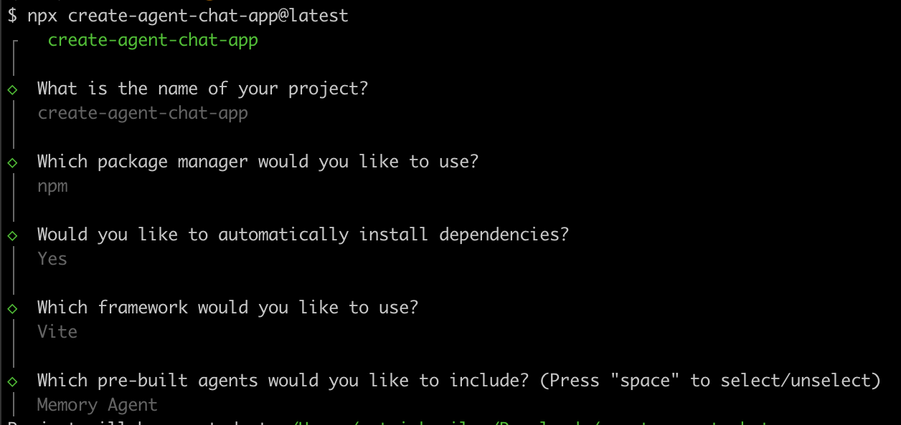
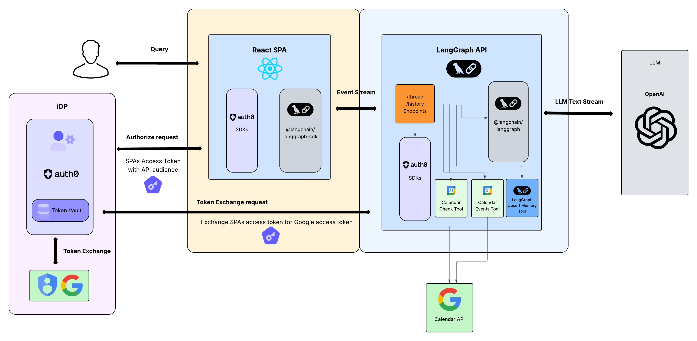

# React.js Single Page Application with LangGraph API, Auth0 AI, AI SDK, and Token Vault

This example demonstrates a **Memory Agent** chat application built with [LangGraph](https://langchain-ai.github.io/langgraph/) that integrates [Auth0 AI](https://auth0.ai) for authentication and third-party API access through Token Vault. The agent maintains conversation history, remembers user preferences, and can access external APIs like Google Calendar on behalf of authenticated users.

This project was generated using the public [`langchain-ai/create-agent-chat-app`](https://github.com/langchain-ai/create-agent-chat-app) generator and enhanced with Auth0 authentication and Token Vault integration for secure third-party API access.

<div align="center">
  
</div>

<br/>

This app was generated with the following options:
<div align="center">
  
</div>

<br/>

You can read further about all Auth0 integration steps after in [AUTH0_INTEGRATION.md](./AUTH0_INTEGRATION.md).

## What is the Memory Agent?

The Memory Agent is an intelligent conversational assistant that:

- **Remembers conversations**: Stores and retrieves user interactions and preferences across sessions
- **Learns about users**: Builds a knowledge base about user preferences, habits, and context
- **Accesses external APIs**: Integrates with third-party services like Google Calendar using secure token exchange
- **Maintains context**: Uses stored memories to provide personalized responses and recommendations

The agent can help with tasks like:
- Scheduling and calendar management
- Remembering personal preferences and past conversations
- Providing contextual recommendations based on user history
- Coordinating with external services while maintaining security

Learn more at the [langchain-ai/memory-agent-js](https://github.com/langchain-ai/memory-agent-js) repo.

## Features

This template leverages a modern stack for building a full-stack agent application with authentication:

- **LangGraph Memory Agent**: Persistent memory management with conversation history
- **Auth0 Authentication**: Secure user authentication with Auth0 SPA integration
- **Token Vault Integration**: Secure third-party API access without exposing sensitive credentials
- **Google Calendar Integration**: Access user calendar data through OAuth2 with Auth0 connections
- **React Frontend**: Modern UI built with React, TypeScript, and Tailwind CSS
- **Monorepo Structure**: Organized with Turbo for build orchestration
- **Custom Auth Handler**: Implements Auth0 JWT validation for LangGraph API
- **Works Everywhere**: Compatible with both self-hosted and LangGraph Platform deployments

## Authentication & Token Exchange Flow

This application implements Auth0's Token Vault for secure third-party API access:



Auth0's Token Vault enables the LangGraph API to exchange a SPA's access token for third-party API access tokens. This approach addresses a key security challenge for applications that cannot securely store refresh tokens. The flow works by having the React client send its access token to the LangGraph API, which then performs the token exchange using Resource Server Client credentials.

**Key Benefits:**
- **No x-api-key required**: Auth0 serves as the identity provider instead of API keys
- **Secure token management**: Token Vault handles refresh tokens and credential storage
- **Third-party API access**: Seamless integration with external APIs like Google Calendar
- **Platform flexibility**: Works with both self-hosted and LangGraph Platform deployments

## Project Structure

```
.
├── apps/
│   ├── agents/               # LangGraph agents backend
│   │   ├── src/
│   │   │   ├── auth.ts       # Custom Auth0 authentication handler
│   │   │   ├── auth0-ai.ts   # Auth0 AI Token Vault integration
│   │   │   └── memory-agent/ # Memory agent implementation
│   │   │       ├── graph.ts  # LangGraph state machine
│   │   │       ├── tools/    # Agent tools (calendar, memory)
│   │   │       └── prompts.ts
│   │   └── langgraph.json    # LangGraph configuration
│   └── web/                  # React frontend
│       ├── src/
│       │   ├── components/   # UI components
│       │   ├── hooks/        # React hooks including Auth0
│       │   └── lib/          # Auth0 configuration
│       └── vite.config.ts
├── package.json              # Root package.json with workspaces
└── turbo.json               # Turbo configuration
```

## Setup Instructions

### Prerequisites

- Node.js 18 or later
- npm 7 or later (for workspace support)
- An [OpenAI key](https://platform.openai.com/docs/libraries#create-and-export-an-api-key) or [Anthropic key](https://console.anthropic.com/) for the LLM
- Google Cloud Project with Calendar API enabled (for calendar integration)

### 1. Auth0 Configuration

1. **Create an Auth0 Application** (Single Page Application):
   - Go to your [Auth0 Dashboard](https://manage.auth0.com/)
   - Create a new **Single Page Application**
   - Configure the following settings:
     - **Allowed Callback URLs**: `http://localhost:5173`
     - **Allowed Logout URLs**: `http://localhost:5173`
     - **Allowed Web Origins**: `http://localhost:5173`
     - Enable "Allow Refresh Token" in Grant Types under Advanced Settings

2. **Create an Auth0 API**:
   - In your Auth0 Dashboard, go to APIs
   - Create a new API with an identifier (audience)
   - Enable "Allow Offline Access" in Access Settings
   - Note down the API identifier for your environment variables

3. **Create a Custom API Client** (for Token Vault Token Exchange):
   - The Custom API Client allows your API server to perform token exchanges using **access tokens** instead of **refresh tokens**. This client enables Token Vault to exchange an access token for an external API access token (e.g., Google Calendar API).
   - Setup steps:
      - Go to the API you created in Step #2 and click the **Add Application** button in the right top corner.
      - After that click the **Configure Application** button in the right top corner.
      - Note down the <code>client id</code> and <code>client secret</code> for your environment variables.

4. **Configure a Social Connection for Google in Auth0**:
   - Make sure to enable all `Calendar` scopes from the Permissions options
   - Make sure to enable Token Vault for the Connection under the Advanced Settings
   - Make sure to enable the connection for your SPA Application created in Step 1 and the Resource Server Client created in Step 3
   - Test the connection in Auth0 "Try Connection" screen and make sure connection is working & configured correctly
   - Enable Token Vault for the connection under Advanced Settings

### 2. Environment Variables

#### Agents (.env)
Copy `apps/agents/.env.example` to `apps/agents/.env`:

```bash
# LangSmith (optional)
# LANGSMITH_API_KEY=""
# LANGSMITH_TRACING_V2="true"
# LANGSMITH_PROJECT="default"

# LLM Provider (choose one)
ANTHROPIC_API_KEY=your-anthropic-key
OPENAI_API_KEY=your-openai-key

# Auth0 Configuration
AUTH0_DOMAIN=your-auth0-domain.auth0.com
AUTH0_AUDIENCE=your-api-identifier
AUTH0_CUSTOM_API_CLIENT_ID=your-custom-api-client-id
AUTH0_CUSTOM_API_CLIENT_SECRET=your-custom-api-client-secret

# Development only (not for production)
NODE_TLS_REJECT_UNAUTHORIZED=0
```

#### Web App (.env)
Copy `apps/web/.env.example` to `apps/web/.env`:

```bash
VITE_AUTH0_DOMAIN=your-auth0-domain.auth0.com
VITE_AUTH0_CLIENT_ID=your-spa-client-id
VITE_AUTH0_AUDIENCE=your-api-identifier
VITE_LANGGRAPH_API_URL=http://localhost:2024
```

### 3. Install Dependencies

```bash
# Install all dependencies from the project root
npm install
```

### 4. Run the Application

#### Start both services in development mode:
```bash
npm run dev
```

This will start:
- **LangGraph API**: `http://localhost:2024` (agents backend)
- **React App**: `http://localhost:5173` (web frontend)

Or run them individually:
```bash
npm run dev --workspace=apps/agents  # Run LangGraph API
npm run dev --workspace=apps/web     # Run React frontend
```

## Authentication Architecture

### Custom Auth Handler

The LangGraph API uses a custom authentication handler that validates Auth0 JWT tokens:

```typescript
// apps/agents/src/auth.ts
auth.authenticate(async (request: Request) => {
  // Handles both Authorization header (local dev) and x-api-key header (LangGraph Platform)
  const token = xApiKeyHeader ?? authHeader;
  
  // Verify JWT using Auth0 JWKS
  const { payload } = await jwtVerify(token, JWKS, {
    issuer: `https://${AUTH0_DOMAIN}/`,
    audience: AUTH0_AUDIENCE,
  });
  
  return {
    identity: payload.sub!,
    auth_type: "auth0",
    _credentials: { accessToken: token }
  };
});
```

### Token Vault Integration

The agents use Auth0 AI's Token Vault for secure third-party API access:

```typescript
// apps/agents/src/auth0-ai.ts
const auth0AI = new Auth0AI({
  auth0: {
    domain: process.env.AUTH0_DOMAIN!,
    clientId: process.env.AUTH0_CUSTOM_API_CLIENT_ID!,
    clientSecret: process.env.AUTH0_CUSTOM_API_CLIENT_SECRET!,
  },
});

export const withGoogleCalendar = auth0AI.withTokenForConnection({
  connection: "google-oauth2",
  scopes: ["https://www.googleapis.com/auth/calendar.freebusy"],
  accessToken: async (_, config) => {
    return config.configurable?.langgraph_auth_user?._credentials?.accessToken;
  },
  subjectTokenType: SUBJECT_TOKEN_TYPES.SUBJECT_TYPE_ACCESS_TOKEN,
});
```

## API Endpoints

The LangGraph API provides the following endpoints:

- **POST /runs/stream**: Stream agent conversations with authentication
- **GET /threads/{thread_id}/state**: Get conversation state and memory
- **POST /threads/{thread_id}/runs**: Start new conversation runs

All endpoints require valid Auth0 JWT tokens in the `Authorization` header.

## Key Features

### Memory Management
- **Persistent Storage**: Conversations and user preferences stored across sessions
- **Context Awareness**: Agent remembers previous interactions and learns user preferences
- **Memory Tools**: Dedicated tools for storing and retrieving user information

### Calendar Integration
- **Google Calendar API**: Check calendar availability and view events
- **Secure Access**: Uses Token Vault for credential management
- **Real-time Data**: Access live calendar information during conversations

### Authentication
- **Auth0 Integration**: Secure user authentication with Universal Login
- **JWT Validation**: Custom auth handler validates tokens against Auth0 JWKS
- **Token Exchange**: Seamless third-party API access without credential exposure

## Documentation References

For more information on the underlying technologies:

- [LangGraph Platform Authentication](https://docs.langchain.com/langgraph-platform/auth)
- [LangGraph Custom Authentication](https://docs.langchain.com/langgraph-platform/custom-auth)
- [Auth0 AI Documentation](https://auth0.ai/docs)
- [LangGraph Documentation](https://langchain-ai.github.io/langgraph/)

## Deployment

This template works great for both standalone/self-hosted deployments and when hosting the agent in the LangGraph Platform:

### Self-Hosted
- Deploy the agents backend to any Node.js hosting platform
- Deploy the React frontend to static hosting (Vercel, Netlify, etc.)
- Configure environment variables for your production environment

### LangGraph Platform
- Deploy agents using the [LangGraph Platform cloud](https://docs.langchain.com/langgraph-platform/deploy-to-cloud) or run self-hosted agents with the [LangGraph.js CLI](https://langchain-ai.github.io/langgraphjs/concepts/langgraph_cli/)
- The custom auth handler automatically adapts to platform requirements
- No changes needed to the authentication logic

## Additional Commands

```bash
# Build all workspaces
npm run build:all

# Lint all workspaces
npm run lint:all

# Format code
npm run format

# Type check
npm run type-check
```

## Architecture Benefits

- **Security**: No API keys required, Auth0 handles identity management
- **Scalability**: Memory persistence allows for long-term user relationships
- **Flexibility**: Works with both LangGraph Platform and self-hosted deployments
- **Integration**: Seamless third-party API access through Token Vault
- **Developer Experience**: Modern tooling with TypeScript, React, and Turbo

This example provides a solid foundation for building production-ready AI agents with secure authentication and external API integration.
